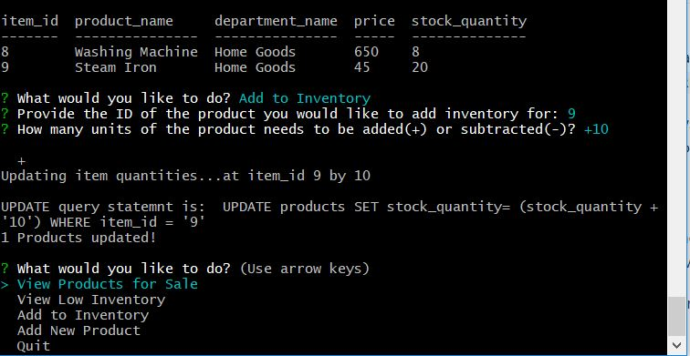

<h1>
A Node.js & MySQL application - bamazon
</h1>
# bamazon
An Amazon-like storefront with MySQL. The app will take in orders from customers and deplete stock from the store's inventory. The app also tracks product sales across the store's departments and then provides a summary of the highest-grossing departments in the store.
<h2>
Specifications and Functionality
</h2>

A MySQL Database called <code>bamazon</code> has been created.

A Table inside of that database called <code>products</code>.

The products table have each of the following columns:

<ul>
<li>

item_id (unique id for each product)

</li>
<li>

product_name (Name of product)

</li>
<li>

department_name

</li>
<li>

price (cost to customer)

</li>
<li>

stock_quantity (how much of the product is available in stores)

</li>
</ul>

This database has been populated with around 10 different products.

A Node application called <code>bamazonCustomer.js</code> has been created. Running this application will first display all of the items available for sale. 

 

The app should then prompt users with two messages.

<ul>
<li>The first should ask them the ID of the product they would like to buy.</li>
<li>The second message should ask how many units of the product they would like to buy.</li>
</ul>

 
</li>

Once the customer has placed the order, the application checks if the store has enough of the product to meet the customer's request.

<ul>
<li>If not, the app logs a phrase like <code>Insufficient quantity!</code>, and then prevent the order from going through.</li>
</ul>

However, if your store <em>does</em> have enough of the product, you should fulfill the customer's order.

<ul>
<li>This means updating the SQL database to reflect the remaining quantity.</li>
<li>Once the update goes through, show the customer the total cost of their purchase.</li>
</ul>

<h2>
Challenge #2: Manager View (Next Level)
</h2>
<ul>
<li>

Create a new Node application called <code>bamazonManager.js</code>. Running this application will:

<ul>
<li>

List a set of menu options:

<ul>
<li>

View Products for Sale

</li>
<li>

View Low Inventory

</li>
<li>

Add to Inventory

</li>
<li>

Add New Product

</li>
</ul>
</li>
<li>

If a manager selects <code>View Products for Sale</code>, the app should list every available item: the item IDs, names, prices, and quantities.

</li>
<li>

If a manager selects <code>View Low Inventory</code>, then it should list all items with an inventory count lower than five.

</li>
<li>

If a manager selects <code>Add to Inventory</code>, your app should display a prompt that will let the manager "add more" of any item currently in the store.

</li>
<li>

If a manager selects <code>Add New Product</code>, it should allow the manager to add a completely new product to the store.

</li>
</ul>
</li>
</ul>
<h3> bamazonManager.js Screenshots </h3>

